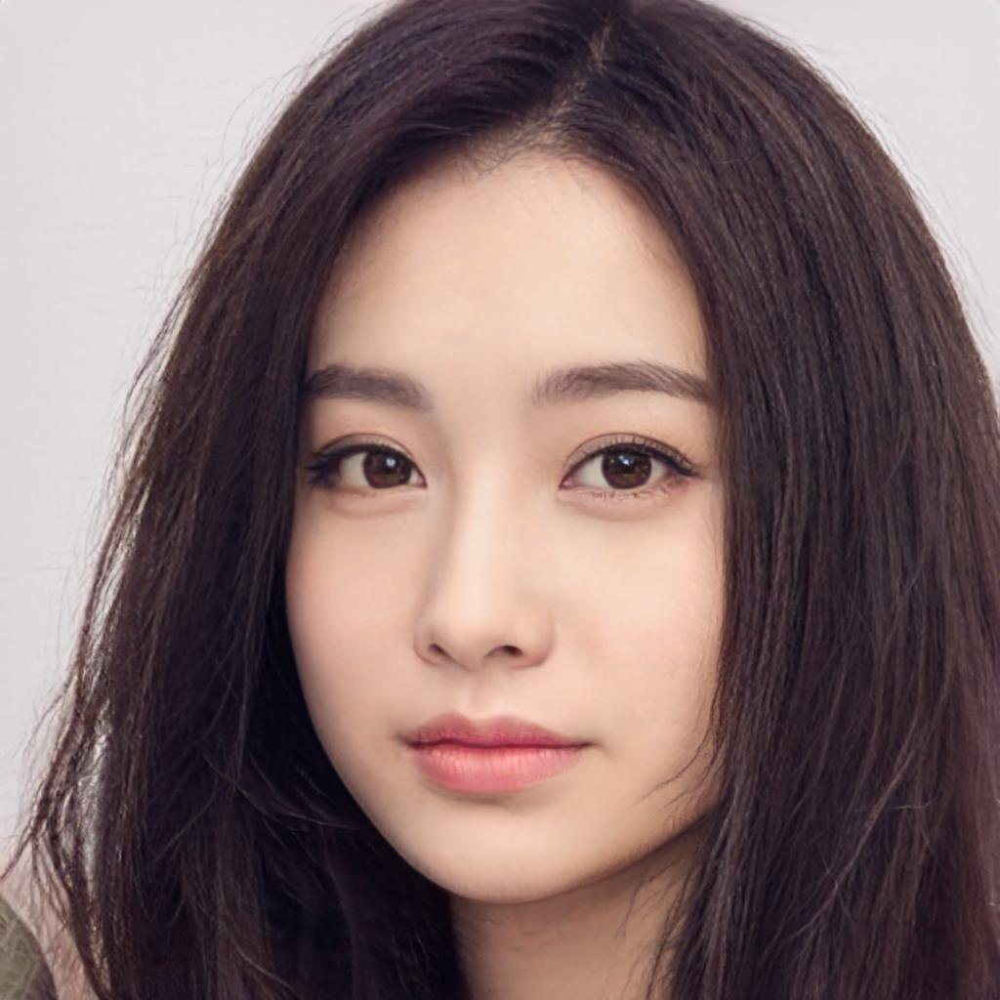
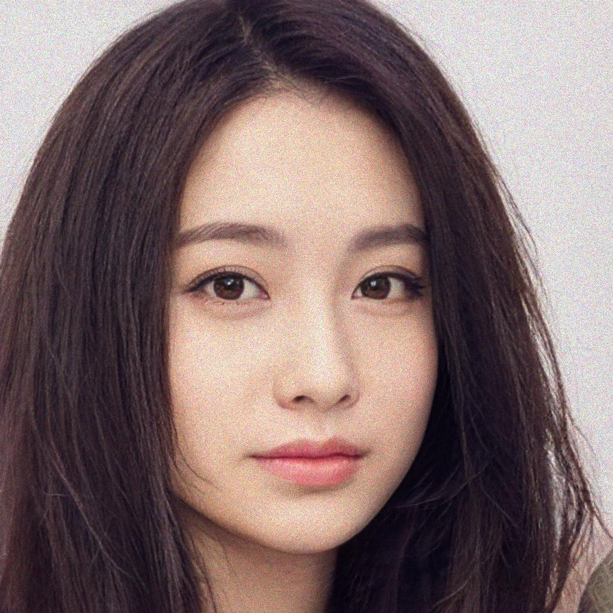
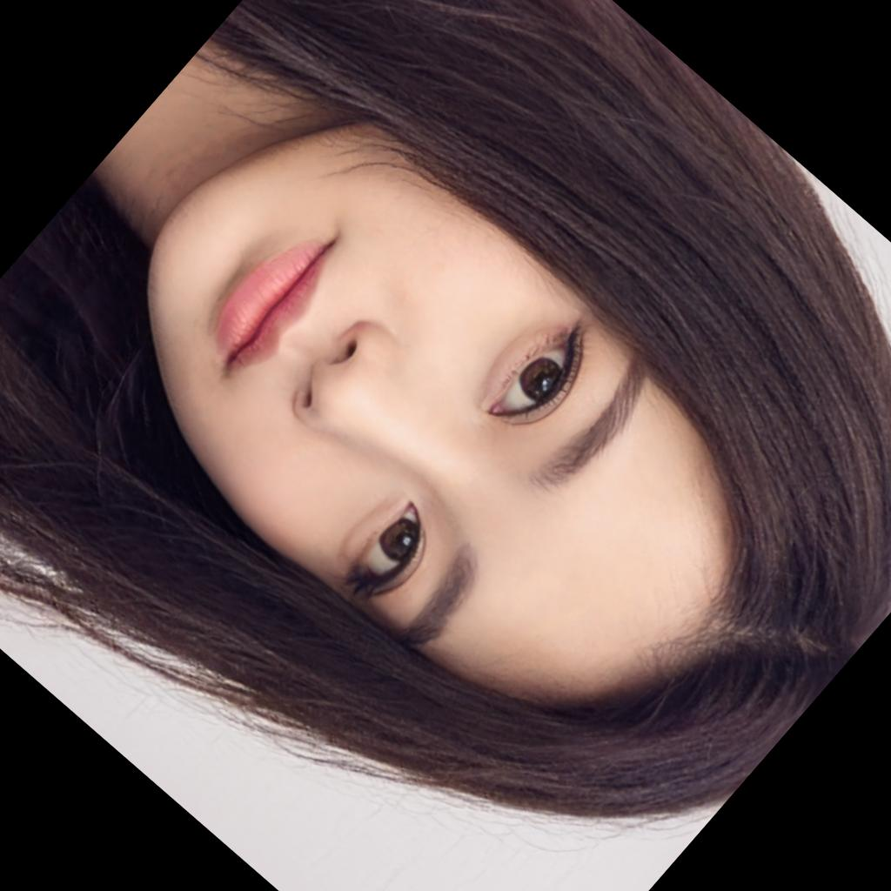
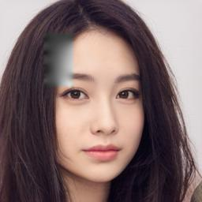
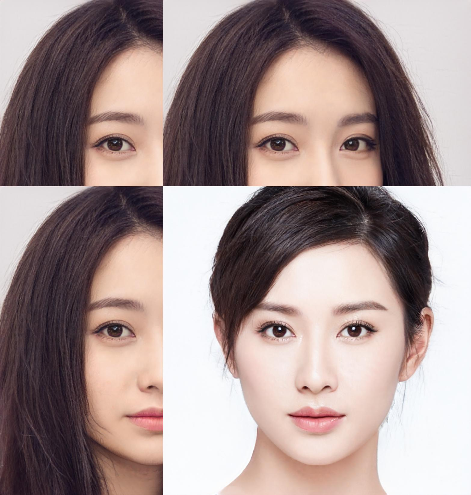
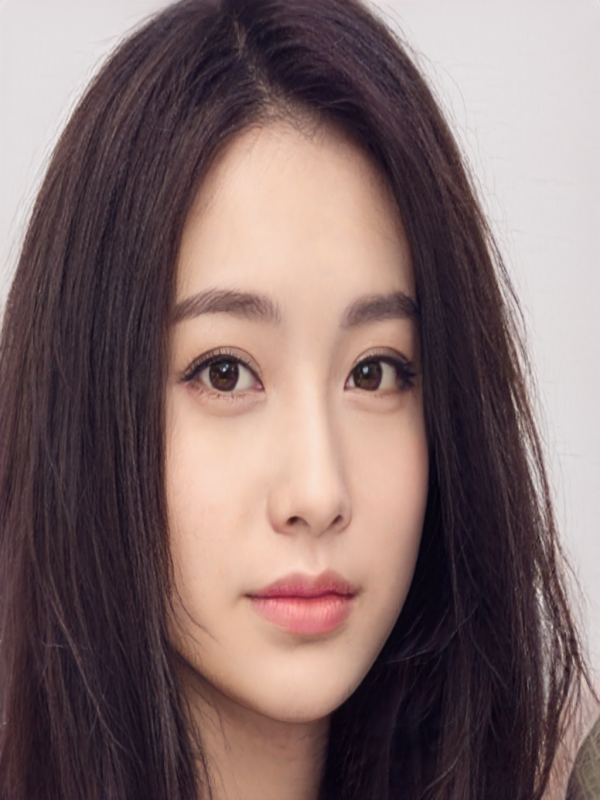
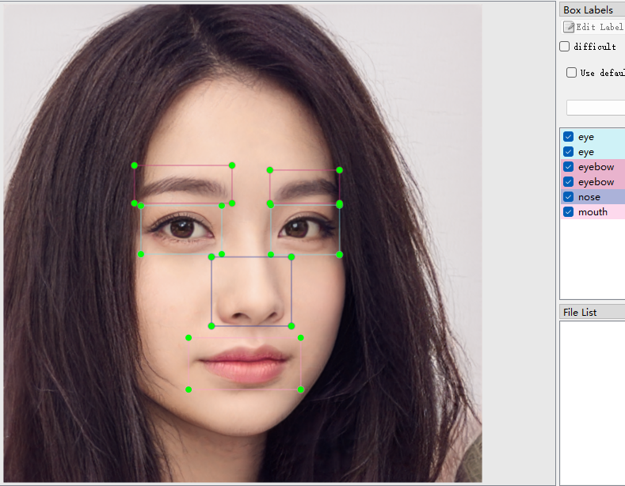
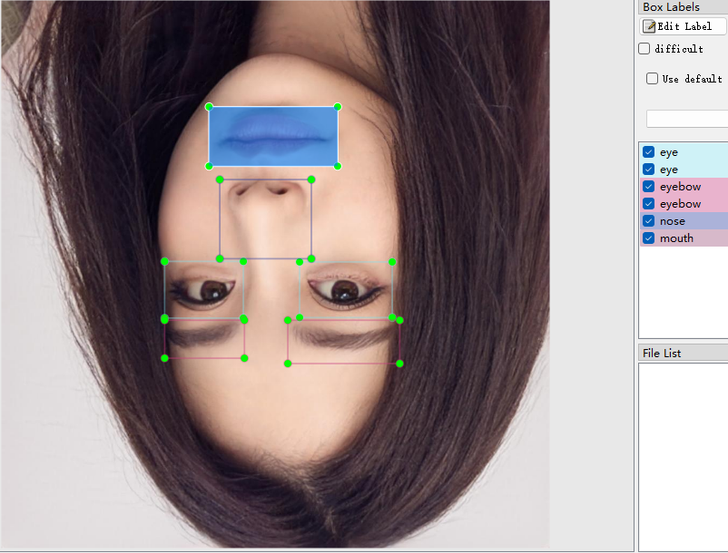
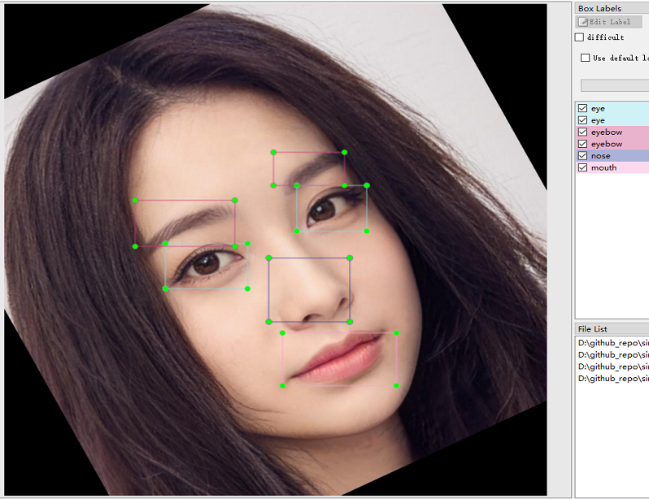

# simple-tools-for-machine-learning(MLTools)
Simple tools for machine learning. Including computer vision, deep learning,...

------

用于机器学习/深度学习/机器视觉用的小工具


[](https://github.com/psf/black)  [](https://app.travis-ci.com/guchengxi1994/simple-tools-for-machine-learning)  [](https://coveralls.io/github/guchengxi1994/simple-tools-for-machine-learning?branch=dev)

## requirements
> * numpy
> * scipy
> * scikit_image
> * tqdm

## How to use

* 无标注文件图像增广 image augmentation (without label files)

  > ```python
  > from mltools.src.augmentation.aug import NoLabelAugmentation
  > n = NoLabelAugmentation(["your_file_1",...,"your_file_n"], False, augNumber=3)
  > ```
  >
  > **parameters**
  >
  > ```python
  > """
  > @ imgs : 增广图片数组
  > @ parallel : 是否并行（多进程）
  > @ savedPath : 结果保存路径，可不填
  > @ augNumber : 增广数量
  > @ augMethods : 增广用到的方法，默认的有 "noise", "rotation", "trans", "flip", "zoom"
  > @ optionalMethods : 增广用到的可选方法，默认为空数组,包括 crop, cutmix, cutout, distort, inpaint,mixup, mosaic, resize
  > """
  > ```
  >
  > **codes**
  >
  > ```python
  > if __name__ == "__main__":
  >     # random augmentation
  >     n.go()
  >     # only flip
  >     n.onlyFlip()
  >     # only noise
  >     n.onlyNoise()
  >     # only rotation
  >     n.onlyRotation()
  >     # translation
  >     n.onlyTranslation()
  >     # zoom
  >     n.onlyZoom()
  >     # crop
  >     n.onlyCrop()
  >     # cutmix
  >     n.append("3.png")
  >     n.onlyCutmix()
  >     # distort
  >     n.onlyDistort()
  >     # inpaint
  >     n.onlyInpaint(reshape=True)
  >     # mosaic
  >     n.onlyMosiac()
  >     # resize
  >     n.onlyResize()
  > ```
  >
  > **examples**
  >
  >|<div style="width:200px">Column1</div>|<div style="width:200px">Column2</div>|<div style="width:200px">Column3</div>|
  >|------------------------------------------------------------|------------------------------------------------------------|------------------------------------------------------------|
  >|原始图片original|随机增广randomaugmentation|翻转flip|
  >||||
  >|噪声noise|旋转rotation|平移translation|
  >||||
  >|变焦zoom|裁切crop|cutmix|
  >||||
  >|畸变distort|修补inpaint|mosaic|
  >||||
  >|修改尺寸resize|...||
  >||||
  >
  
* labelImg标注

  > ```python
  > ```
  >
  > **parameters**
  >
  > ```python
  > ```
  >
  > **codes**
  >
  > ```python
  > ```
  >
  > **examples**
  >
  > | 标注类型 | 结果                                                         |
  > | -------- | ------------------------------------------------------------ |
  > | 原始图像 |  |
  > | flip     |  |
  > | rotate   |                        |
  >
  > 

## note:
> * 测试用的图像为GAN生成，并无侵权行为
>
>   > The testing images are generated by Gan. There is **no** infringement.
>
> * 这个repo是[mask2json](https://github.com/guchengxi1994/mask2json)的一次重构，原始的代码是使用python3.6完成的，同时`numpy`等包的版本也比较低（高版本出了很多问题，尤其是`numpy`，有的时候3.8版本可以正常通过测试3.9版本就会出错）；加上同时使用了`opencv-python`和`scikit_image`做图像处理，有点冗余；而且一直想做的可视化界面也半途而废了，所以才有了重构的想法
>
>   >This repo is a refactor of [mask2json]( https://github.com/guchengxi1994/mask2json ). The original codes are completed with python3.6, and the versions of packages such as `numpy` are relatively low (there are many problems with the higher version, especially `numpy`. Sometimes version 3.8 can pass the tests normally, but version 3.9 will raise errors); In addition, both `opencv-python` and `scikit` are used in image processing , which is redundant;  That's why I came up with the idea of reconstruction
>
> * 可视化界面有可能会用flutter做，参考[我用flutter做的移动端标注工具](https://github.com/AI-change-the-world/ai-apps)，不过可能不会提供修改的功能（稍微有点复杂）
>
>   > The UI tool may be developed with flutter. Refer to [the mobile end annotation tool I made with flutter](https://github.com/AI-change-the-world/ai-apps).
>
> * `skimage` 保存`png`的时候很慢，保存成`jpg`的时候要快很多,尽量使用`jpg`保存。参考这个 [issue](https://github.com/scikit-image/scikit-image/issues/3419)
>
>   > `skimage` saves `PNGs` is  slow, but it saves `JPGs` is faster. Refer to this [issue](https://github.com/scikit-image/scikit-image/issues/3419)
>
> * `inpaint`增广，印象中使用`opencv`没有这么慢的(图片越大越慢，同时有可能OOM)，尽量少用
>
>   > `inpaint` is slow with `skimage` . Using `opencv-python` is faster.

## 重构进度
* 2022-07-12 添加`labelImg` 部分增广
* 2022-07-11 大致完成无标注文件的图像增广，更新readme
* 2022-07-04 无标注增广完成(去掉了原版`透视变换`增广)
* 2022-06-13 开始重构，抄/改（主要还是统一`cv2`和`skimage`）了部分代码
