# simple-tools-for-machine-learning(MLTools)
Simple tools for machine learning. Including computer vision, deep learning,...

------

用于机器学习/深度学习/机器视觉用的小工具

### [UI-tools](./mltools_viewer/README.md) 


|                                                    |                                                    |
| -------------------------------------------------- | -------------------------------------------------- |
| demo1                                              | demo2                                              |
| 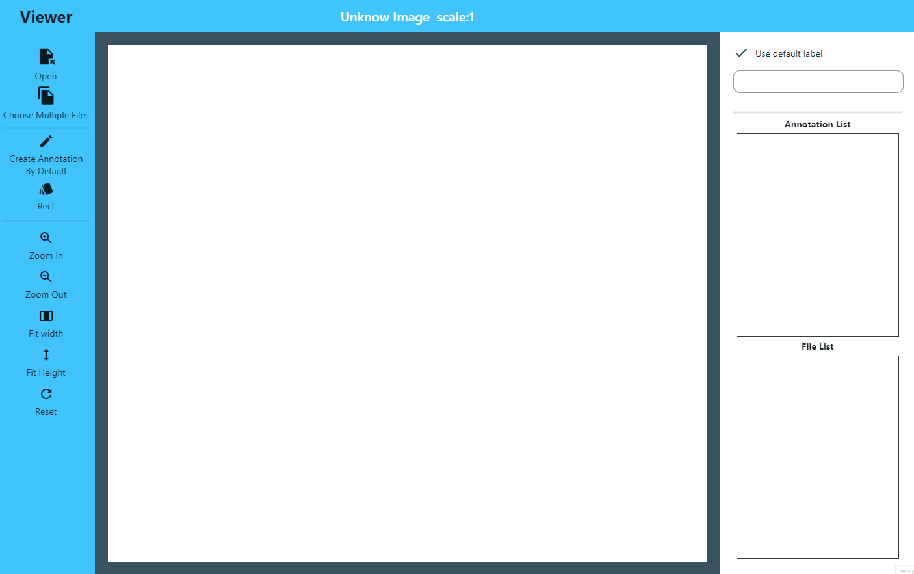 | 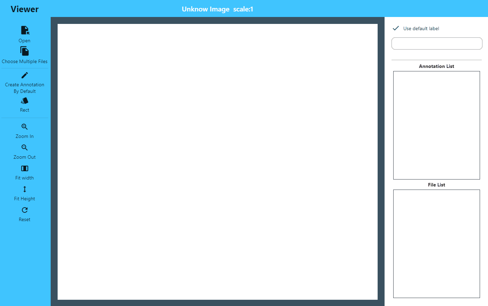 |
| demo3                                              | ...                                                |
| 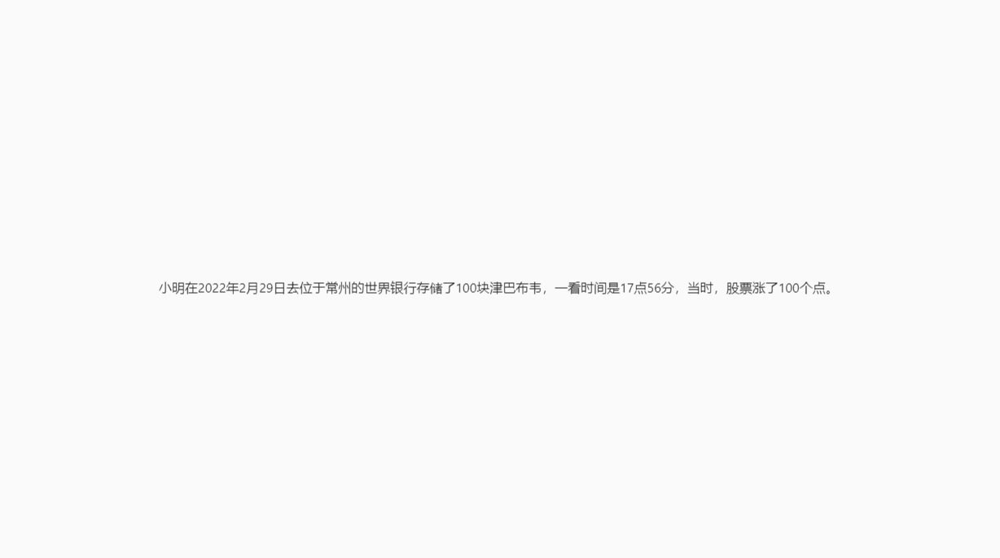   |                                                    |


[](https://github.com/psf/black)  [](https://app.travis-ci.com/guchengxi1994/simple-tools-for-machine-learning)  [](https://coveralls.io/github/guchengxi1994/simple-tools-for-machine-learning?branch=dev)

## requirements
> * numpy
>
> * scipy
>
> * scikit_image
>
> * tqdm
>
> * xmltodict
>
> * matplotlib
>
> * PyYAML
>
>   > PyYAML 在低版本（5.3左右）有一个致命的漏洞，但是它是`distutils `，在升级的时候使用以下指令
>   >
>   > `pip3 install --ignore-installed PyYAML`
>   >
>   > 或者指定版本号
>   >
>   > `pip3 install --ignore-installed PyYAML==5.4`

## How to use

* 工具 (utils)

  * [xml2createML](test/xml2createML_test.py)
  
    > 将`labelImg`格式（Pascal VOC）转化为`createML`（json）格式
    >
    > Convert `labelImg` format (Pascal VOC) to `createML` (JSON) format
  
  * [img2xml](mltools/src/utils/img2xml/multi_object_process.py)
  
    > 用来生成Pascal VOC标注文件的一个简单工具
    >
    > A simple tool for generating Pascal VOC annotation files
  
  * [json2mask](test/convert_json_to_mask_test.py)
  
    > 将`labelme`格式的json文件转化为用于训练的mask文件（使用的时候输入绝对路径）
    >
    > Convert the JSON file in `labelme` format into a mask file for training (enter the absolute path when using)
  
  * [json2xml](mltools/src/utils/json2xml/json2xml.py)
  
    > 将`labelme` json格式文件转化为`labelImg` xml格式文件
    >
    > Convert `labelme` JSON file to `labelimg` XML file
  
  * [split](mltools/src/utils/split/split_xml.py)
  
    > 将长宽比差距较大的图像和标注文件（例如，管道图），切分为长宽比1：1的图像和标注文件
    >
    > Images/annotations with a large difference in aspect ratio (eg. pipeline images) , split into  images/annotations  with an aspect ratio of 1:1
  
  * [yolo_train_val_dataset_split](mltools/src/utils/yolo_train_val_dataset_split/script.py)
  
    > yolo格式（txt）的标注文件自动分配训练以及验证数据集
  
  * [widerface_convert](mltools/src/utils/widerface_convert/winderface_convert.py)
  
    > 将[`widerface`](http://shuoyang1213.me/WIDERFACE/)数据集格式转化为可用于`labelImg`展示的xml格式
  
  * [xml2json](mltools/src/utils/xml2json/xml2json.py)
  
    > xml格式`labelImg`数据转化为json`labelme`格式数据
  
  * [xml2mask](mltools/src/utils/xml2mask/x2m.py)
  
  * [mlfiles_standardization](mltools/src/utils/mlfiles_standardization/standardization.py)

    > 将[viewer](./mltools_viewer/README.md)生成的`.ml`格式文件转化为标准的`labelme`以及`labelImg`标注文件(一个`ml`文件同时生成两种格式，如果同时存在`rect`和`polygon`两种形式的标注类型的话)
  
  * 
  
* 无标注文件图像增广 (image augmentation without label files)

  > ```python
  > from mltools.src.augmentation.aug import NoLabelAugmentation
  > n = NoLabelAugmentation(["your_file_1",...,"your_file_n"], False, augNumber=3)
  > ```
  >
  > **parameters**
  >
  > ```python
  > """
  > @ imgs : 增广图片数组
  > @ parallel : 是否并行（多进程）
  > @ savedPath : 结果保存路径，可不填
  > @ augNumber : 增广数量
  > @ augMethods : 增广用到的方法，默认的有 "noise", "rotation", "trans", "flip", "zoom"
  > @ optionalMethods : 增广用到的可选方法，默认为空数组,包括 crop, cutmix, cutout, distort, inpaint,mixup, mosaic, resize
  > """
  > ```
  >
  > **codes**
  >
  > ```python
  > # random augmentation
  > n.go()
  > # only flip
  > n.onlyFlip()
  > # only noise
  > n.onlyNoise()
  > # only rotation
  > n.onlyRotation()
  > # translation
  > n.onlyTranslation()
  > # zoom
  > n.onlyZoom()
  > # crop
  > n.onlyCrop()
  > # cutmix
  > n.append("3.png")
  > n.onlyCutmix()
  > # distort
  > n.onlyDistort()
  > # inpaint
  > n.onlyInpaint(reshape=True)
  > # mosaic
  > n.onlyMosaic()
  > # resize
  > n.onlyResize()
  > ```
  > 
  >**examples**
  > 
  >|<div style="width:200px">Column1</div>|<div style="width:200px">Column2</div>|<div style="width:200px">Column3</div>|
  >|------------------------------------------------------------|------------------------------------------------------------|------------------------------------------------------------|
  >|原始图片original|随机增广randomaugmentation|翻转flip|
  >||||
  >|噪声noise|旋转rotation|平移translation|
  >||||
  >|变焦zoom|裁切crop|cutmix|
  >||||
  >|畸变distort|修补inpaint|mosaic|
  >||||
  >|修改尺寸resize|...||
  >||||
  >
  
* `labelImg`标注增广  (augmentation for `labelImg`)

  > ```python
  > from mltools.src.augmentation.aug_labelimg import LabelimgAugmentation
  > l = LabelimgAugmentation(["0.png"], ["0.xml"])
  > ```
  >
  > **parameters**
  >
  > ```python
  > """ ...
  >     labels: List[str], 标注储存的地址，要和图片一一对应
  > """
  > ```
  >
  > **codes**
  >
  > ```python
  > # flip
  > l.onlyFlip()
  > # rotate
  > l.onlyRotate()
  > # translation
  > l.onlyTrans()
  > # zoom
  > l.onlyZoom()
  > # noise
  > l.onlyNoise()
  > # mosaic
  > l.append("3.png", "3.xml")
  > l.onlyMosaic()
  > # resize
  > l.onlyResize()
  > ```
  > 
  >**examples**
  > 
  >| 标注类型    | 结果                           |
  > | ----------- | ------------------------------------------------------------ |
  > | 原始图像    |  |
  > | flip        |  |
  > | rotate      |              |
  > | translation | 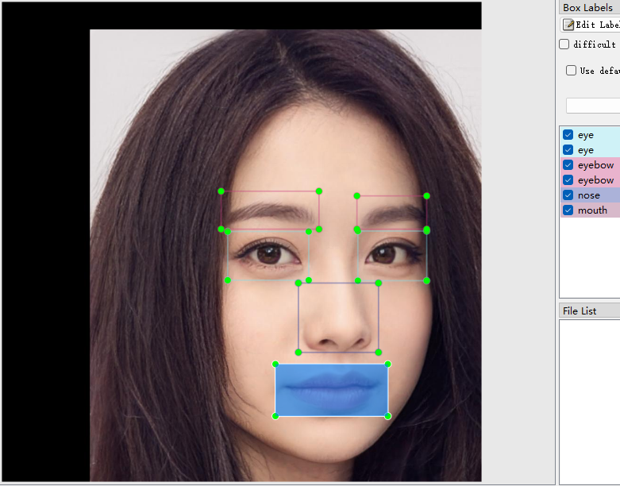 |
  > | zoom        | 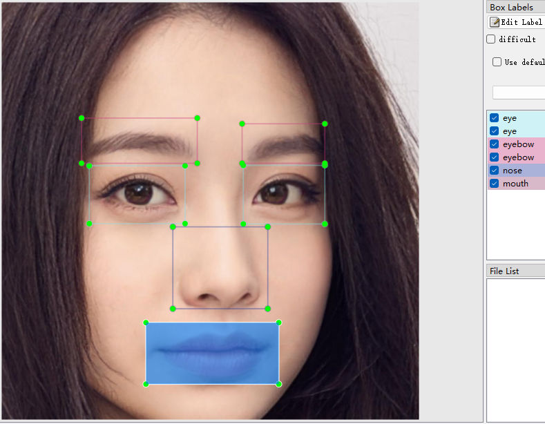 |
  > | noise       | 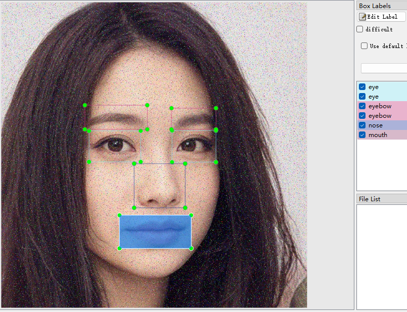 |
  > | mosaic      | 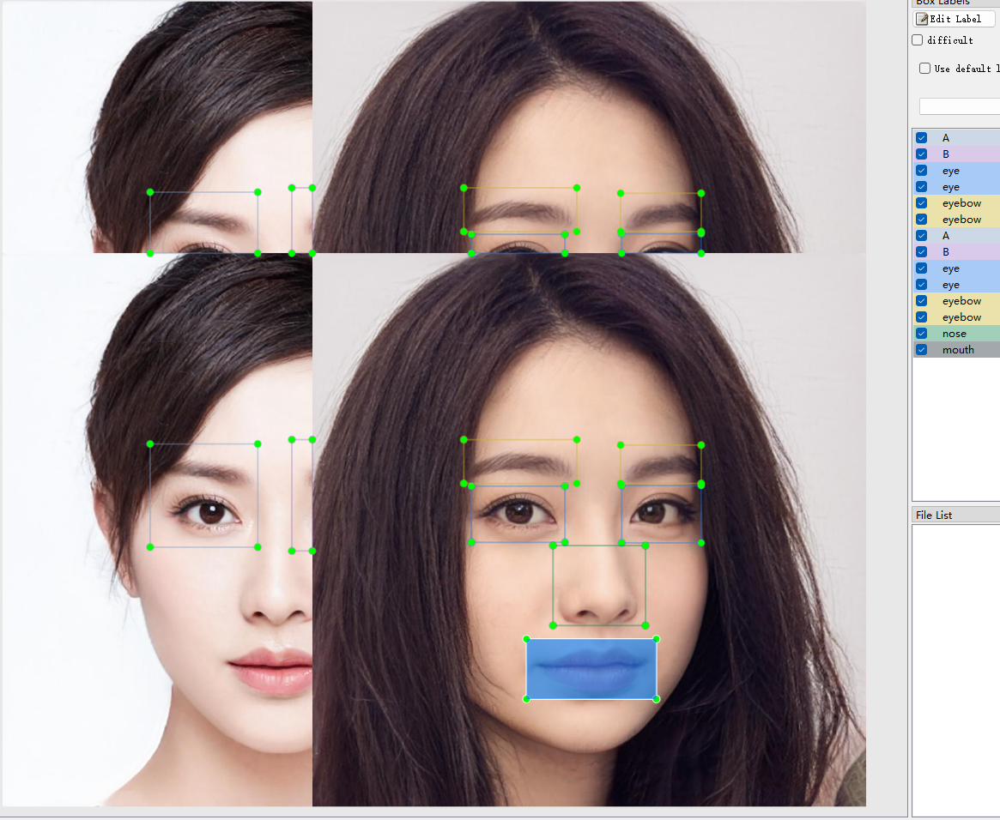 |
  > | resize      | 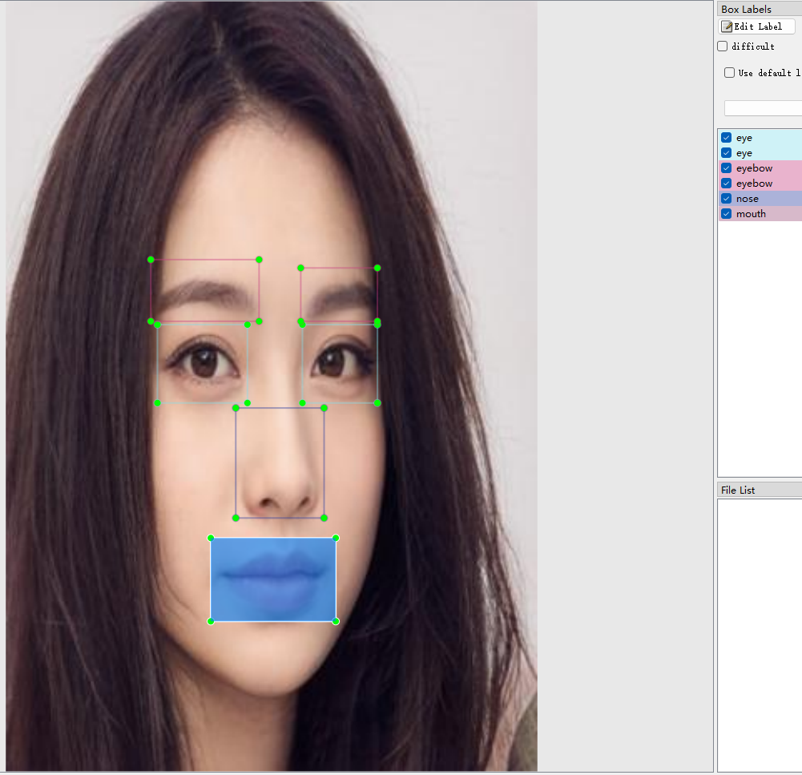 |
  > | ...    |                                |
  > 
  
* `labelme`标注增广  (augmentation for `labelme`)

  > ```python
  > from mltools.src.augmentation.aug_labelme import LabelmeAugementation
  > l = LabelmeAugementation(["3.png"],["3.json"],"3.yaml")
  > ```
  >
  > **parameters**
  >
  > ```python
  > """ ...
  >  labels: List[str], 标注储存的地址，要和图片一一对应
  >  yamlPath: str, 储存标注信息的文件，形如：
  >  	label_names:
  >       _background_: 0
  >       eye: 1
  >       mouth: 3
  >       nose: 2
  > """
  > ```
  >
  > **codes**
  >
  > ```python
  > # flip
  > l.onlyFlip()
  > # rotate
  > l.onlyRotate()
  > # translation
  > l.onlyTrans()
  > # zoom
  > l.onlyZoom()
  > # noise
  > l.onlyNoise()
  > ```
  >
  > **examples**
  >
  > | 标注类型       | 结果                                                         |
  > | -------------- | ------------------------------------------------------------ |
  > | original image | 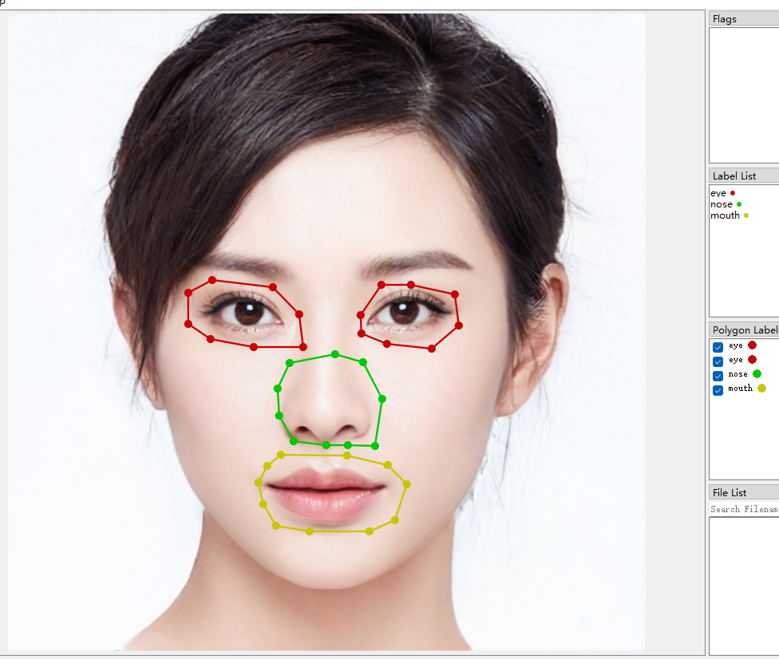 |
  > | flip           | 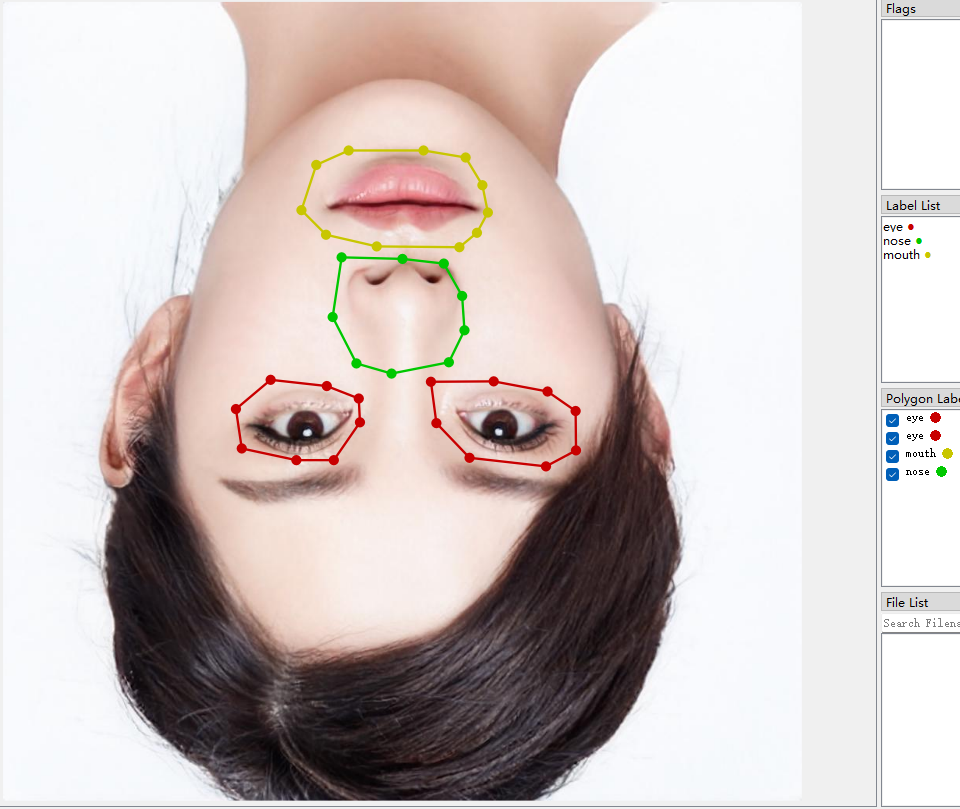 |
  > | noise          | 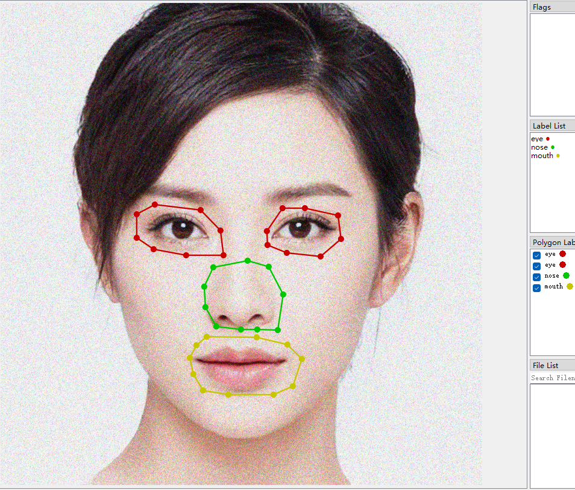 |
  > | rotate         | 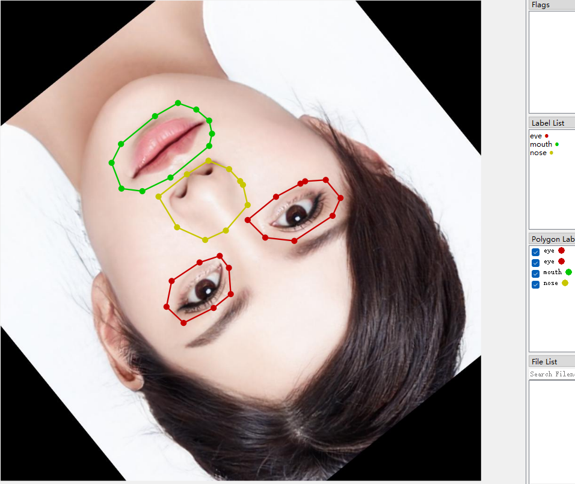 |
  > | translation    | 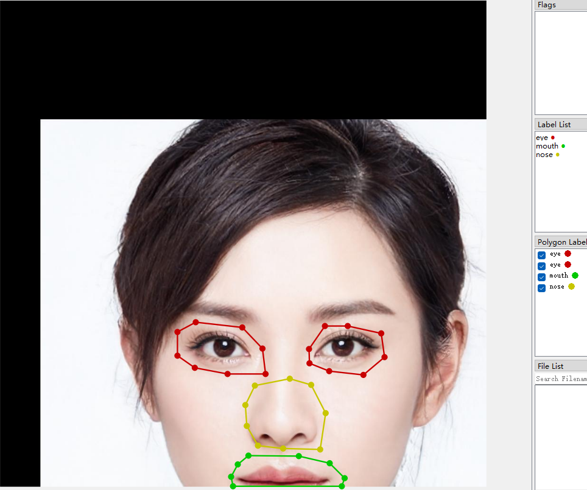 |
  > | zoom           |  |
  > | ...            |                                                              |
  >
  > 

## note:
> * 测试用的图像为GAN生成，并无侵权行为
>
>   > The testing images are generated by Gan. There is **no** infringement.
>
> * 这个repo是[mask2json](https://github.com/guchengxi1994/mask2json)的一次重构，原始的代码是使用python3.6完成的，同时`numpy`等包的版本也比较低（高版本出了很多问题，尤其是`numpy`，有的时候3.8版本可以正常通过测试3.9版本就会出错）；加上同时使用了`opencv-python`和`scikit_image`做图像处理，有点冗余；而且一直想做的可视化界面也半途而废了，所以才有了重构的想法
>
>   >This repo is a refactor of [mask2json]( https://github.com/guchengxi1994/mask2json ). The original codes are completed with python3.6, and the versions of packages such as `numpy` are relatively low (there are many problems with the higher version, especially `numpy`. Sometimes version 3.8 can pass the tests normally, but version 3.9 will raise errors); In addition, both `opencv-python` and `scikit` are used in image processing , which is redundant;  That's why I came up with the idea of reconstruction
>
> * 可视化界面有可能会用flutter做，参考[我用flutter做的移动端标注工具](https://github.com/AI-change-the-world/ai-apps)，不过可能不会提供修改的功能（稍微有点复杂）
>
>   > The UI tool may be developed with flutter. Refer to [the mobile end annotation tool I made with flutter](https://github.com/AI-change-the-world/ai-apps).
>
> * `skimage` 保存`png`的时候很慢，保存成`jpg`的时候要快很多,尽量使用`jpg`保存。参考这个 [issue](https://github.com/scikit-image/scikit-image/issues/3419)
>
>   > `skimage` saves `PNGs` is  slow, but it saves `JPGs` is faster. Refer to this [issue](https://github.com/scikit-image/scikit-image/issues/3419)
>
> * `inpaint`增广，印象中使用`opencv`没有这么慢的(图片越大越慢，同时有可能OOM)，尽量少用
>
>   > `inpaint` is slow with `skimage` . Using `opencv-python` is faster.

## 进度
* 2022-07-25 添加一个方法，用于转化`viewer`生成的文件到`labelme`和`labelImg`标注文件(v0.1.1)
* 2022-07-15 已完成重构工作，准备着手UI工具开发(v0.1.0)
* 2022-07-14 添加`labelme`部分增广，添加部分工具
* 2022-07-13 添加`labelImg` 部分增广
* 2022-07-12 添加`labelImg` 部分增广
* 2022-07-11 大致完成无标注文件的图像增广，更新readme
* 2022-07-04 无标注增广完成(去掉了原版`透视变换`增广)
* 2022-06-13 开始重构，抄/改（主要还是统一`cv2`和`skimage`）了部分代码
