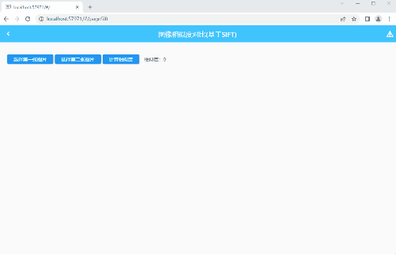
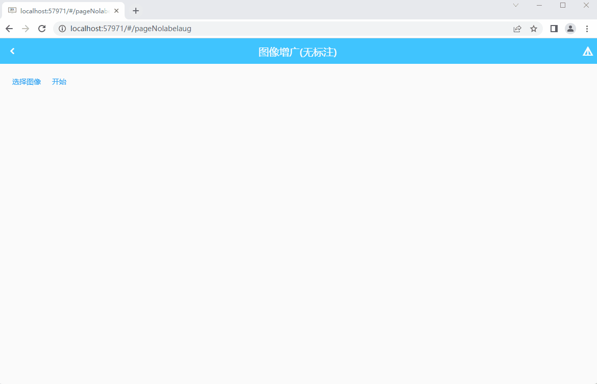

<h1 align="center">
  <br/>mltools_server
</h1>

# Installation
```
pip install -r requirements.txt     # 安装图像处理相关模块
pip install -r requirements_server.txt # 安装服务器相关模块
```

# Run
``` 
python main.py
```
然后就会在端口`14378`上启动服务了（客户端上写的服务器IP需要手动更改一下）

# Examples

* sift

  

* augmentation

  

* ...